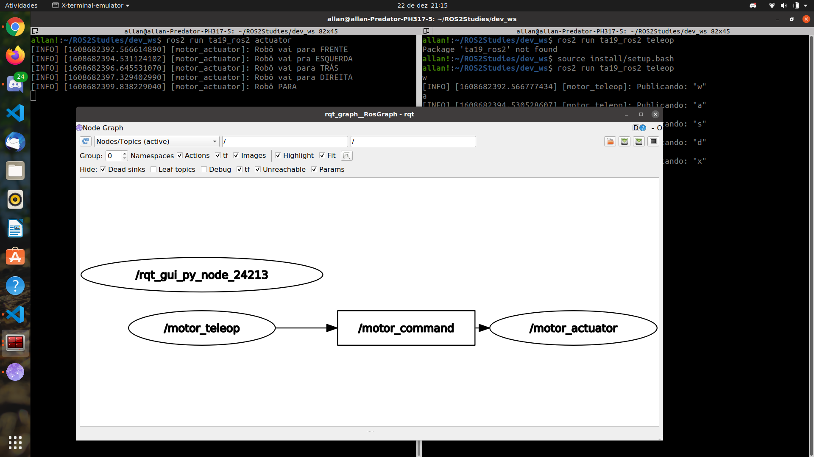

## Robótica Móvel - Atividade 19:
## Teleoperação de motores
### Por Gabriel Nascarella e Allan Cedric

### Um pacote ROS2 com scripts para realizar a teleoperação simples de um robô móvel com 2 motores de locomoção.

=======
### Um pacote ROS2 com scripts para realizar a teleoperação simples abstraída de um robô móvel com 2 motores de locomoção.
#### Mostra a comunicação entre 2 nodos, `motor_teleop` e `motor_actuator`, um mandando comandos para o outro.
